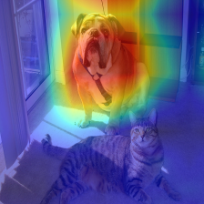

[](https://github.com/gongliyu/Grad-CAM/actions)
# Grad-CAM
Implement the Grad-CAM algorithm using PyTorch. Please refer to
the [paper](https://arxiv.org/abs/1610.02391) for more details: Selvaraja et al.
"Grad-CAM: Visual Explanations from Deep Networks via Gradient-based Localization",
IJCV, 2019.

 

## Basic idea
Gradient Class Activation Map (Grad-CAM) is useful for analyzing which part
of an image (or feature map) is most important to determine a specific class.
In other words, we can look into the black box of convolutional neural networks
to some extent. The idea is that the importance of a pixel in the feature can
be measured by the product of the gradient of the classification score (logits)
w.r.t the pixel and the feature response in the position of this pixel.

## How to use
The algorithm is implemented as a single function `grad_cam.grad_cam`
```python
from grad_cam import grad_cam

cam = grad_cam(model, img, feature_layer='layer4.2.relu', score_layer=None, class_index=None)
```
where `model` is a PyTorch neural network model (module), `img` is a `torch.Tensor`
representing one image (or a batch of image) with size (N, C, H, W). `feature_layer`
is the layer producing the feature map. Similarly, we can specify the layer which produce the
classification score (logits). `score_layer` will be default to the last layer of the model if
not specified. `class_index` specify which category we want to analyze, will be default to the
category with the highest classification score if not specified.